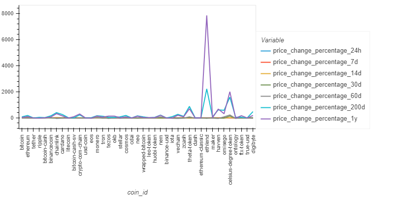
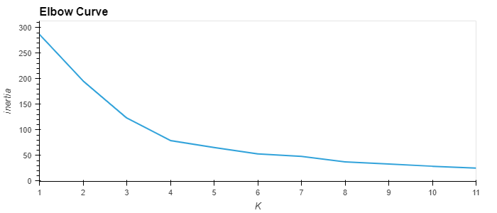
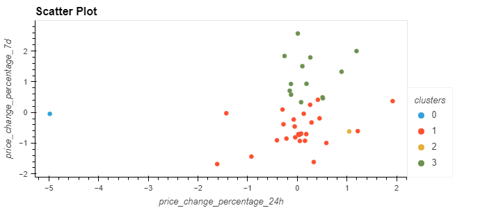
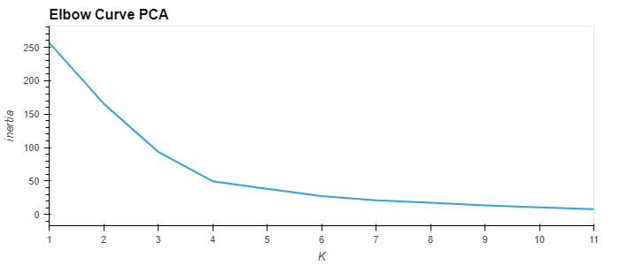
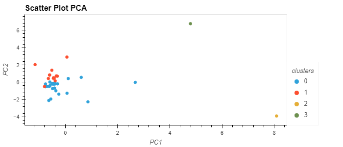

# CryptoClustering
Week 19 Challenge: Unsupervised Machine Learning

### Original  Data Visualization

### Elbow Line Plot

### Scatter Plot

### PCA Elbow Line Plot

### PCA Scatter Plot

### Composite Elbow Line Plot

### Composite Scatter Plot

